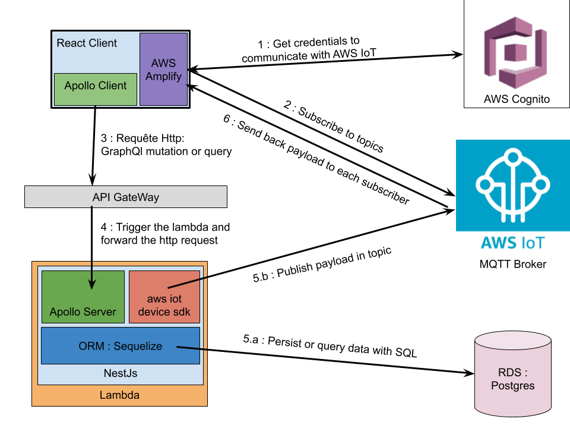
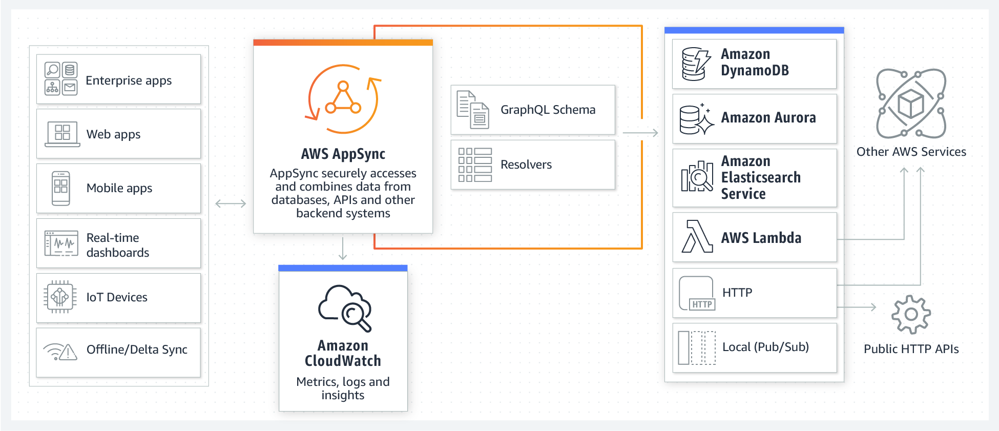
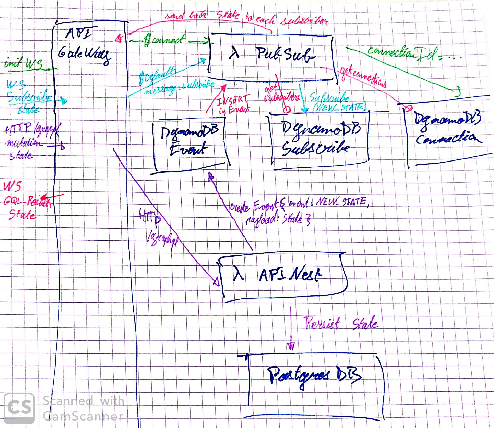
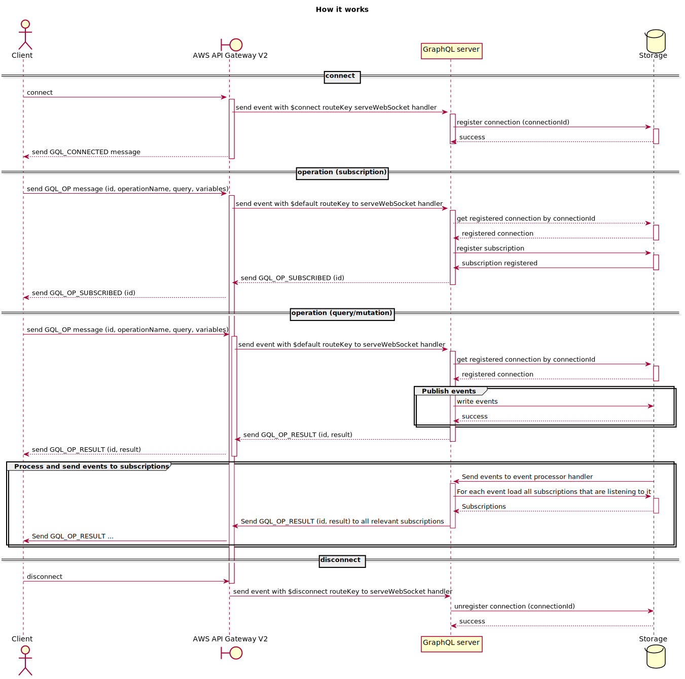
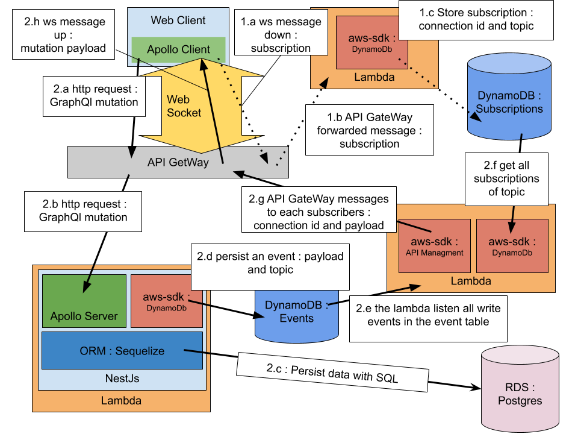
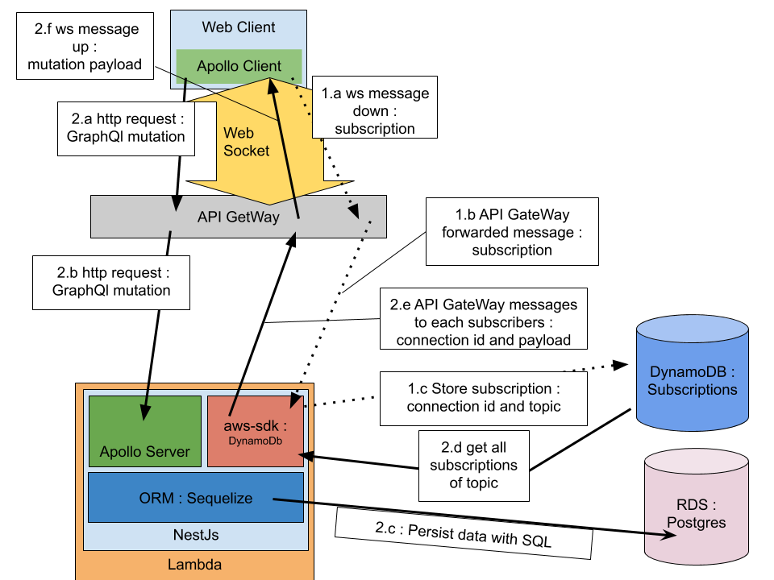

# Implement serverless real time

* Status: proposed
* Deciders: MaximeT, BenjaminG, NicolasB, LoicC, AxelB, CorentinD
* Date: 27-06-2019

## Context and Problem Statement

We want to migrate the backend of a website to a serverless architecture with AWS Lambdas. 
Even if it looks more complex than using a container with the node/graphQL server for example,
we chose to use serverless to be more familiar with this technology.

The website implements a realtime feature to keep all the instances of frontends of a user synchronized.

The current stack is :
* Frontend : React with Apollo Client.
* Backend : NestJs with Apollo Server as GraphQL module, Sequelize as ORM.
* DataBase : PostgreSQL.

Every layers are deployed on the same virtual machine on an openstack instance for now.

## Decision Drivers

* The frontend should send GraphQL queries and mutations to the backend.
* The Authentication is based on JWT Token, issued by the backend 
after a first authentication provided by the API of Trello.
* The frontend should receive real time updates only for the connected user's data.
* User A MUST NOT access user B's data.
* The backend MUST send real time updates to the connected client immediately.

## Considered Options

### 1. MQTT Broker (AWS IoT)

**Pro:**

* Functional broker out of the box able to communicate with a web client.
* Simple to understand.

**Cons:**

* The frontend authentication is only optimized for Cognito and
 [custom authorizer does not work with web client](https://github.com/aws/aws-iot-device-sdk-js/issues/169).
The work around consist in requesting temporary credentials with custom policy to STS through
the backend every hour &rarr; The simplicity of use is KO.   
* It is a an IoT protocol, it seems not made for this kind of problem.

**Schema:**

### 2. AWS AppSync

**Pro:**

* Serverless solution designed to build real time web app with GraphQl.
* Easy to use: providing GraphQl schema and resolver templates is enough to generate 
an available GraphQL endpoint which support GraphQL subscription.
* Complex use case could be dealt with custom lambda resolvers.

**Cons:** 

* The authorization types handle by AppSync are : API_KEY, AWS_IAM, OPENID_CONNECT and
 AMAZON_COGNITO_USER_POOLS.
 [There is no proper way to implement custom authorizers](https://github.com/aws/aws-appsync-community/issues/2). 
 The work around is to create a pipeline of resolvers where the first resolvers is a lambda 
 which check the authentication &rarr; Hard to implement our Trello based authentication.
* Too much refactor : using AppSync require to build an other backend from scratch. 
There are few pieces of code which could be kept.

**Schema:**

### 3. Custom broker of Michalkvasnicak

Use the package [aws-lambda-graphql](https://github.com/michalkvasnicak/aws-lambda-graphql).
**Pro:** 

* Solution designed to migrate our stack to AWS serverless :
 The package is developed to setup a PubSub solution for subscriptions in GraphQL.
* Seems to be the serverless way to implement real time, the solution is only made of serverless basic
 components : Api GateWay, lambdas and dynamoDb.

**Cons:** 

* Performances : latency between the mutation request and the reception of the subscribed message
* Complex architecture &rarr; hard to understand, debug and maintain.

**Schemas:**

### 4. Develop our own custom broker from the solution 3

Start from the [aws-lambda-graphql](https://github.com/michalkvasnicak/aws-lambda-graphql), 
remove unnecessary things and try to improve the performances. 

**Pro:** 

* It allows us to tailor-make a solution matching all the decision drivers.
* Seems to be the serverless way to implement real time, the solution is only made of serverless basic
 components : Api GateWay, lambdas and dynamoDb.

**Cons:** 

* Long to develop.
* No certainty about the results.
* Complex architecture &rarr; hard to understand, debug and maintain.
 
**Schema:** 
 
Not yet sure of the schema, between 
 
 and 
 
 ### 5. Serverless components : realtime-app
 
 Use the package [serverless-components/realtime-app/](https://github.com/serverless-components/realtime-app/).
 It's a Component of [Serverless Components](https://github.com/serverless/components).
 
 The pitch of Serverless Components :
 >It's a framework for provisioning and composing cloud services into higher-level abstractions,
  like features and applications. 
  It depends on external Components, which are javascript libraries that can provision something,
  like infrastructure or a whole software feature built on multiple pieces of infrastructure. 
 
 It's an overlay of the framework [Serverless](https://serverless.com/). 
 
 **Pro:** 
 
 * Solution designed to implement real time in serverless.
 * It implements [Serverless components](https://github.com/serverless/components) which make 
 the solution easy to deploy : a une command to create the AWS infrastructure (if it does not exist) 
 and deploy new code on it.
 
 **Cons:** 
 * No mention of offline development.
 * Only use websockets to communicate with the client &rarr; we can't use the Apollo Server of 
 our current backend which use http to deal with queries and mutations.
 * There is no docs and probably some bugs : when I tested the package, there is a functionality
  I didn't manage to use, I don't know if I badly used the package or if it's a bug.

## Decision Outcome

Chosen option: "4. Develop our own custom broker from the solution 3", because:
* With the solution 1 and 2, we can't easily implement the Trello based authentication.
* Solution 3 have performances issues.
* Solution 5 is incompatible with our current Backend. 
